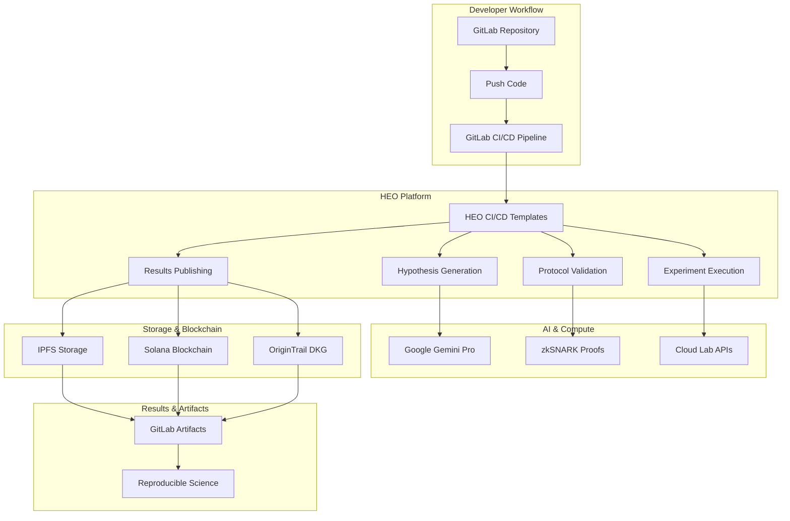
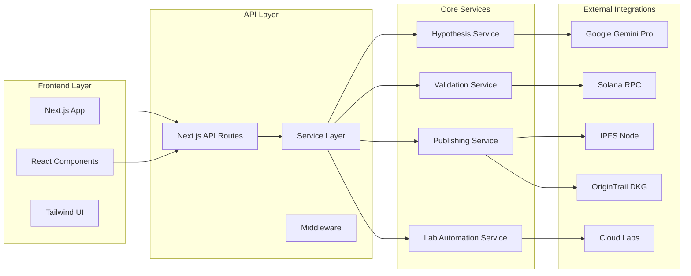
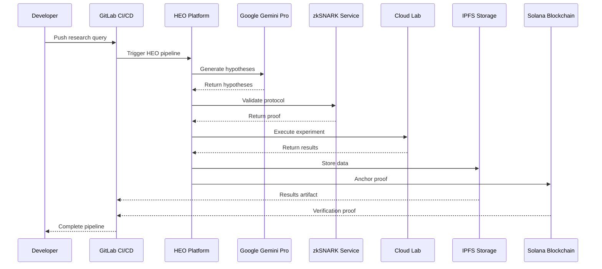
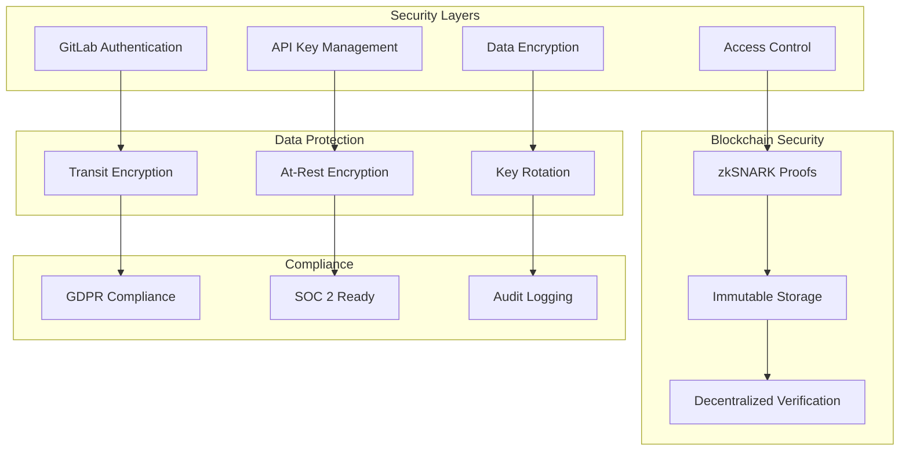
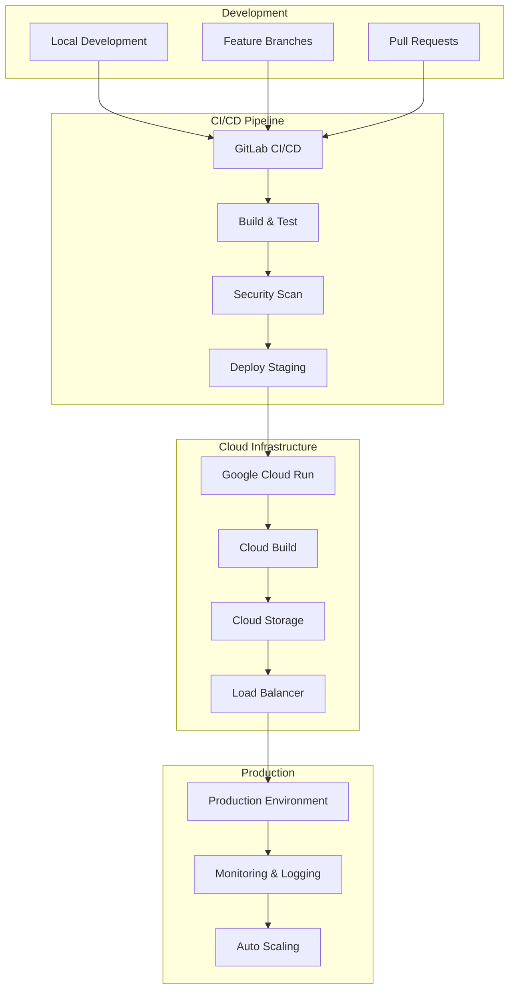
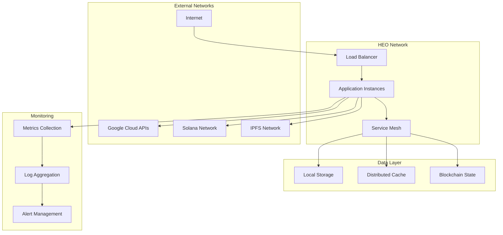
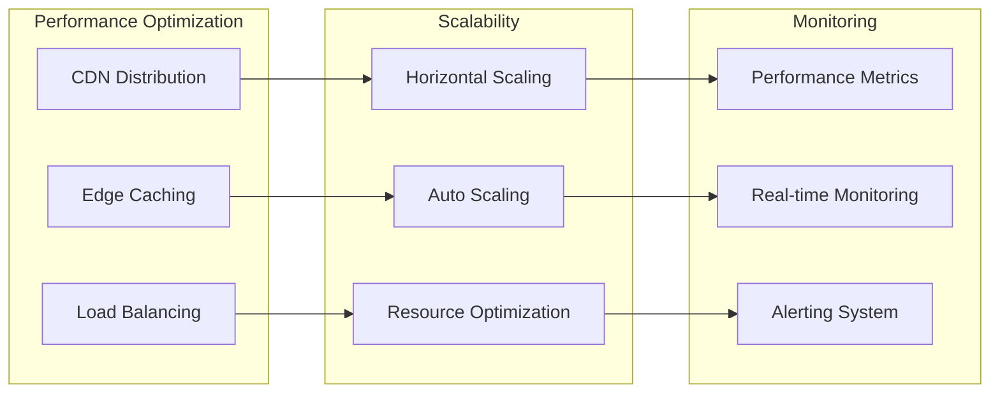
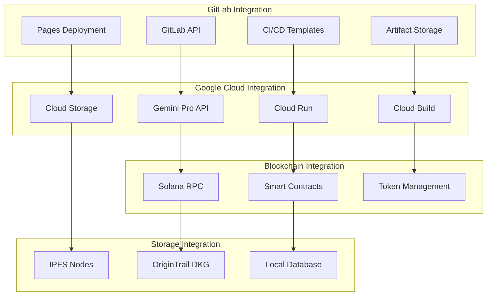

# HEO Architecture Diagrams

## System Overview

## Component Architecture

## Data Flow Architecture

## Security Architecture

## Deployment Architecture

## Network Architecture

## Performance Architecture

## Integration Architecture

## Key Architectural Principles

### 1. **Modularity**

- Each service is independently deployable
- Clear separation of concerns
- Microservices architecture pattern

### 2. **Scalability**

- Horizontal scaling capabilities
- Auto-scaling based on demand
- Efficient resource utilization

### 3. **Security**

- Multi-layer security approach
- Encryption at all levels
- Zero-trust architecture

### 4. **Reliability**

- Fault-tolerant design
- Graceful degradation
- Comprehensive monitoring

### 5. **Performance**

- Optimized for low latency
- Efficient data processing
- Smart caching strategies

### 6. **Interoperability**

- Standard APIs and protocols
- Cross-platform compatibility
- Extensible integration points

---

## Technology Stack Details

| Layer | Technology | Purpose |
|-------|------------|---------|
| **Frontend** | Next.js 14, React 19, TypeScript | User interface and interaction |
| **Backend** | Next.js API Routes, Node.js | Server-side logic and APIs |
| **AI/ML** | Google Gemini Pro 2.5 | Hypothesis generation and analysis |
| **Blockchain** | Solana, OriginTrail DKG | Immutable storage and verification |
| **Storage** | IPFS, OxiGraph, Cloud Storage | Distributed and local data storage |
| **Compute** | Google Cloud Run, Cloud Build | Serverless compute and CI/CD |
| **Monitoring** | Cloud Logging, Custom Metrics | Observability and debugging |
| **Security** | JWT, OAuth, Encryption | Authentication and data protection |

---

This architecture ensures HEO can scale from individual researchers to enterprise research institutions while maintaining security, performance, and reliability.
